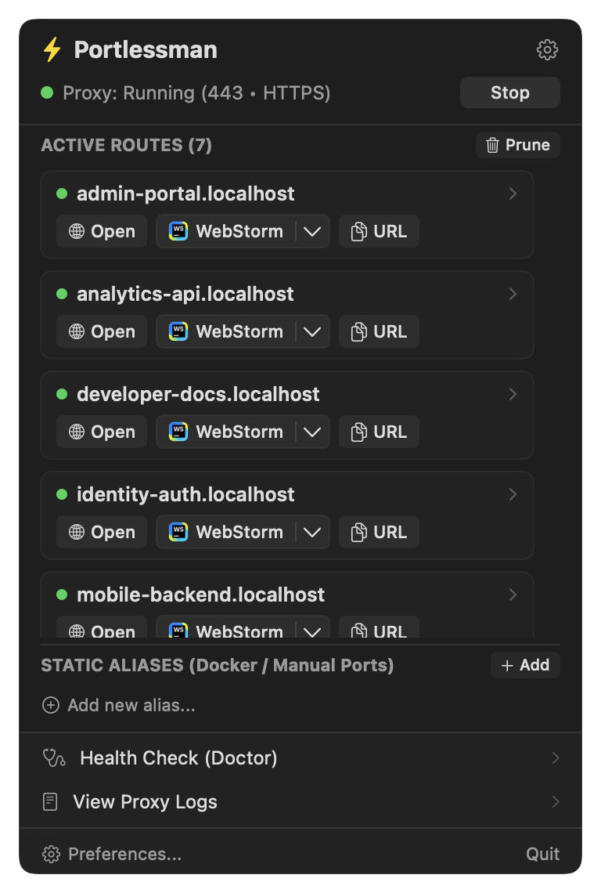
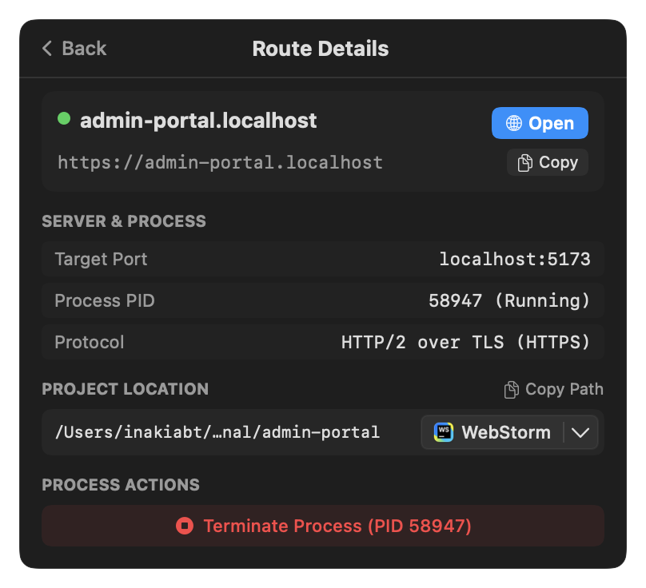
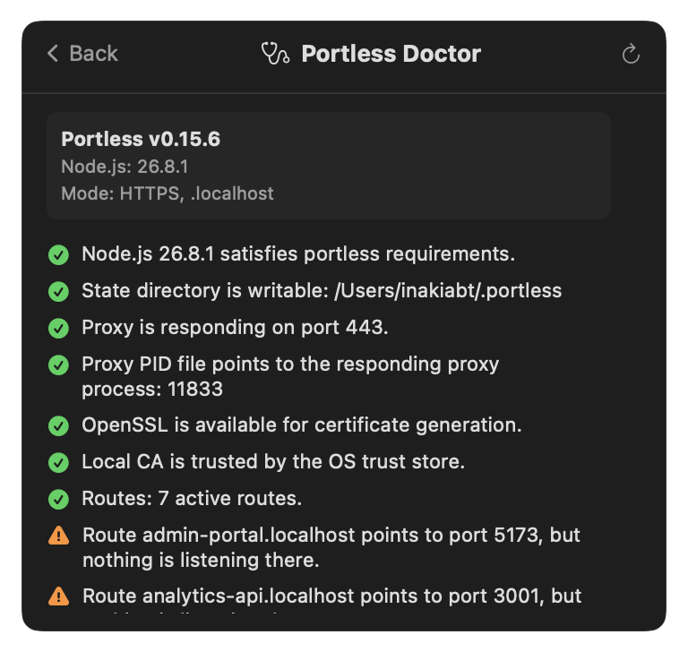
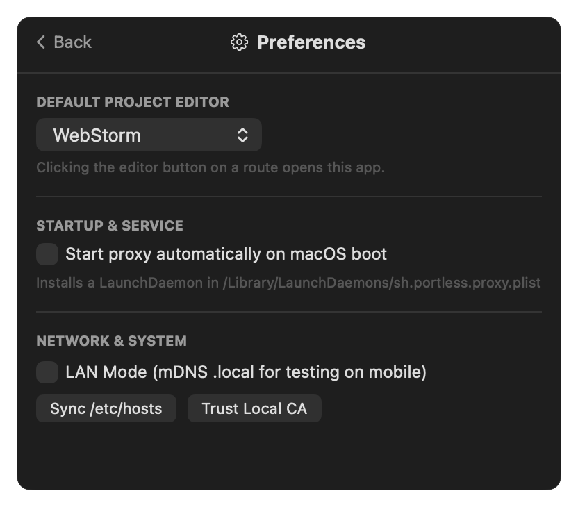

# Portlessman

A lightweight, native macOS menu bar application built with Swift and SwiftUI to administer, monitor, and configure [Portless](https://github.com/vercel-labs/portless) (`@vercel-labs/portless`).


---

## Screenshots

<p align="center">
  
  &nbsp;&nbsp;&nbsp;&nbsp;
  
</p>

<p align="center">
  
  &nbsp;&nbsp;&nbsp;&nbsp;
  
</p>

---

## Features

- **MenuBar Extra (`.window` style)**: Lives discreetly in your menu bar with real-time proxy status, active routes count, and zero Dock clutter (`LSUIElement`).
- **Sub-millisecond Real-Time Watching**: Monitors `~/.portless/routes.json` via native `DispatchSourceFileSystemObject` kqueue events without polling battery drain.
- **Project Folder & Editor Integration**:
  - Automatically resolves each active route's current working directory (`cwd`) via `lsof`.
  - Dynamically discovers installed editors: **WebStorm**, **Visual Studio Code**, **Cursor**, **Zed**, **Sublime Text**, **Ghostty**, **iTerm2**, and **Finder**.
  - One-click open in your default editor via native split button or pick another editor from the dropdown.
- **Route Administration**:
  - Direct browser launch (`open https://<hostname>`).
  - Copy local URL, Tailscale, or ngrok URLs.
  - Safe process termination (`kill <pid>`) for individual stalled servers.
  - **Prune**: One-click cleanup (`portless prune`) for orphan dev servers.
- **Static Aliases Management**:
  - Register and remove custom named routes (`portless alias <name> <port>`), ideal for Docker containers or local databases.
- **Proxy Lifecycle**:
  - Start, stop, and restart the proxy daemon directly from the header.
  - Shows listening port (e.g. `443`), HTTPS/TLS mode, and LAN mode status.
- **In-App Health Check (Doctor)**:
  - Runs and displays `portless doctor` diagnostics (socket responsiveness, root CA trust in Keychain, DNS resolution, node version).
- **Proxy Logs Viewer**:
  - Embedded viewer for `~/.portless/proxy.log` with live tail and copy functionality.
- **Settings & System Service**:
  - Configure default project editor.
  - Toggle macOS LaunchDaemon startup service (`portless service install / uninstall`).
  - Toggle LAN mode (`--lan`) for testing on mobile devices on the same Wi-Fi.
  - Sync `/etc/hosts` for Safari compatibility.
  - Trust local root CA.

---

## Requirements

- macOS 14.0 (Sonoma) or newer.
- Portless CLI installed (`npm install -g portless` or via NVM/Homebrew).

---

## Build & Installation

### Quick Build & Run
```bash
make run
```

### Install to `/Applications`
```bash
make install
```

### Build Only
```bash
make build
# The standalone application bundle is generated at:
# build/Portlessman.app
```

---

## Development

The project is built entirely with native Swift and SwiftUI using Swift Package Manager.

```bash
# Debug build
swift build

# Release build
swift build -c release
```

---

## License

MIT
